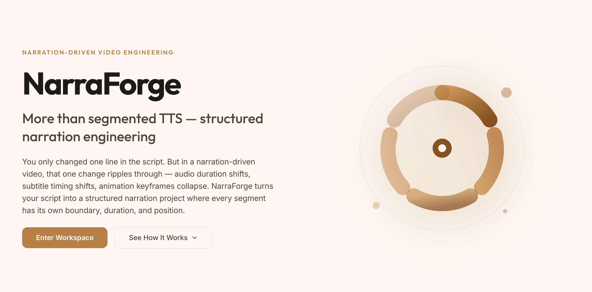
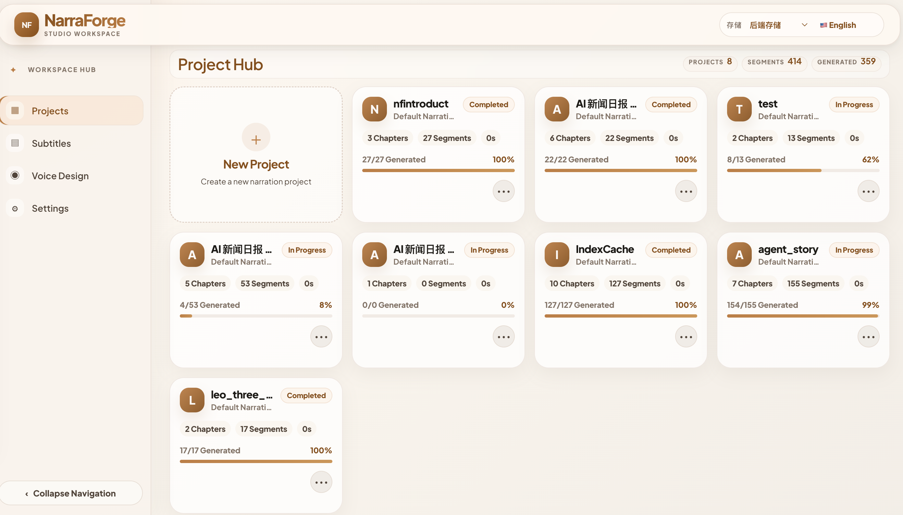
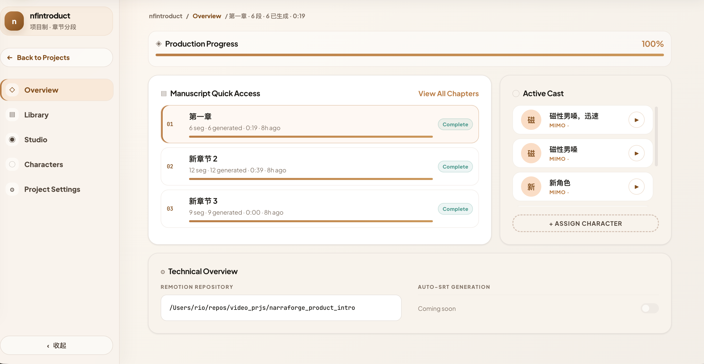
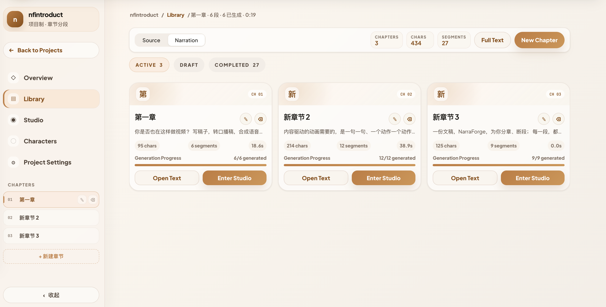
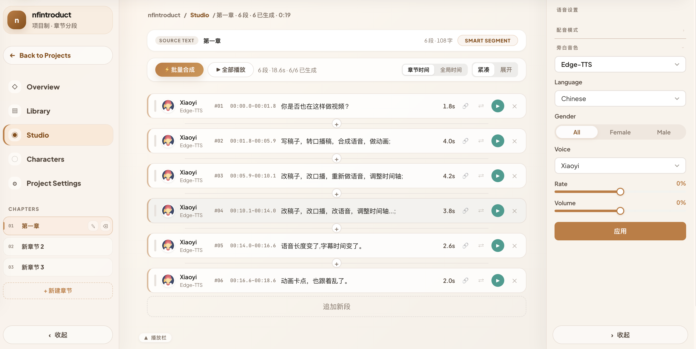
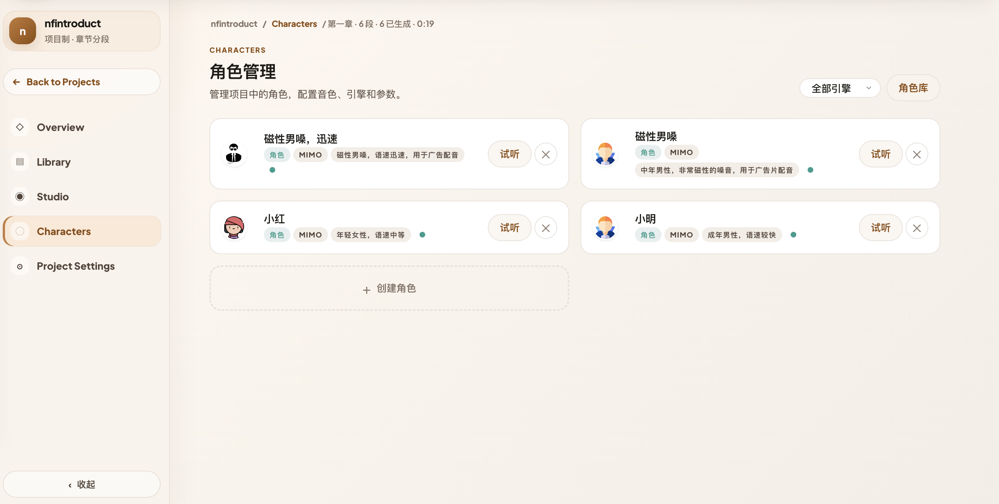
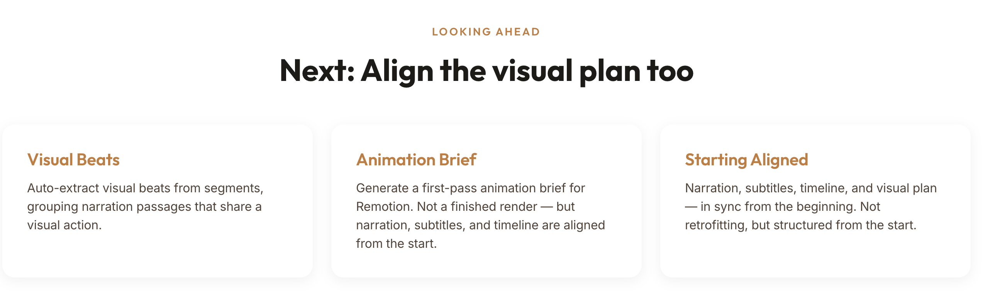

# NarraForge

> [中文说明](README_zh.md)

One-stop AI narration workshop for voice cloning, text-to-speech, and speech-to-subtitle. Designed for narrators and dialogue production with multi-voice project management.



## Highlights

- **Narration + Dialogue** — segmented editor with role assignment, emotion tags, and per-segment voice override
- **Free offline TTS** — Edge-TTS and VoxCPM work out of the box, no API key needed
- **Voice cloning** — upload a sample, get a reusable cloned voice (VoxCPM free local / CosyVoice paid / MiMo paid)
- **Speech-to-subtitle** — Whisper (multilingual) or FunASR (Chinese-optimized, 30x faster than real-time on CPU)
- **LLM-powered** — smart sentence splitting, emotion analysis, subtitle calibration, bilingual translation

## Screenshots

### Landing Page


### Project Hub


### Project Workspace

| Overview | Library | Studio |
|----------|---------|--------|
|  |  |  |

| Roles | Upcoming |
|-------|----------|
|  |  |

## Supported Engines

### Text-to-Speech

| Engine | Price | Highlights |
|--------|-------|-----------|
| **Edge-TTS** | Free | Offline, 400+ voices, no API key |
| **VoxCPM** | Free | Local high-fidelity voice cloning, no API key |
| **CosyVoice (Qwen)** | Paid | Cloud voice cloning, register once reuse forever |
| **MiMo TTS** | Paid | Preset voices / text-based design / audio cloning |

### Voice Cloning

| Engine | Price | Mechanism | Best For |
|--------|-------|-----------|----------|
| **VoxCPM** | Free | Upload → local high-fidelity clone | Default choice, no API key |
| **CosyVoice** | Paid | Upload → cloud register → persistent voice_id | Batch synthesis, repeat use |
| **MiMo** | Paid | Upload → instant clone (stateless) | Quick preview, one-off use |

### Speech-to-Text

| Engine | Language | Speed | GPU |
|--------|----------|-------|-----|
| **Whisper** | 100+ languages | RTF~0.1 | CUDA |
| **FunASR** | Chinese optimized | RTF~0.03 | CUDA / MPS |

## Segmented Editor

Professional timeline for long-form narration:

- **Smart splitting** — LLM semantic analysis or rule-based punctuation split
- **Emotion per segment** — auto-detect (happy / excited / calm / neutral / sad / angry), manual override
- **Role assignment** — narrator and cast roles with dedicated voice configs
- **Voice override** — global voice + per-segment custom, generated segments protected from global changes
- **Stale detection** — auto-flag when global voice changes
- **Play all** — sequential playback with per-character highlight sync
- **Export** — audio (WAV/MP3) and SRT subtitles

## Tech Stack

- **Frontend:** React 19 + TypeScript + Vite + IndexedDB
- **Backend:** Python 3.12+ / FastAPI / SQLAlchemy / SQLite
- **TTS:** Edge-TTS, CosyVoice, MiMo, VoxCPM
- **STT:** Faster-Whisper, FunASR
- **LLM:** MiMo-v2.5-pro (splitting, emotion, calibration, translation)

## Quick Start

### Prerequisites

- Node.js >= 18
- Python >= 3.12
- Qwen API Key (optional, for CosyVoice — [get one](https://dashscope.console.aliyun.com/))
- MiMo API Key (optional — [get one](https://xiaomimimo.com))

### 1. Backend

```bash
cd backend
python -m venv .venv
# Windows: .venv\Scripts\activate
# macOS/Linux: source .venv/bin/activate

uv sync
cp .env.example .env   # edit to add API keys

uv run uvicorn main:app --host 127.0.0.1 --port 8002 --reload
```

### 2. Frontend

```bash
cd frontend
npm install
npm run dev
```

Open `http://localhost:5173`.

### Docker

```bash
docker-compose up --build
```

## Configuration

Core variables in `backend/.env`:

| Variable | Description | Default |
|----------|-------------|---------|
| `QWEN_API_KEY` | Qwen API key | Optional (CosyVoice) |
| `MIMO_API_KEY` | MiMo API key | Optional (MiMo + LLM) |
| `DATABASE_URL` | Database path | `sqlite:///./voice_clone.db` |
| `FUNASR_MODEL` | FunASR model | `paraformer-zh` |

See `docs/ENV.md` for the full list.

## License

MIT
